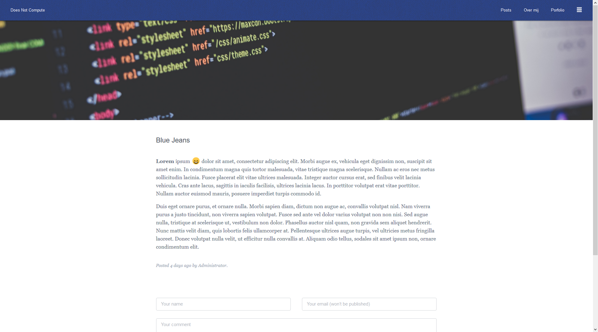

# Blue Jeans

Blue Jeans is a simple theme made for Anchor CMS, based on the default theme (includes the slider). It supports Emoji's, article images and advanced code highlighting.



# Installation

Copy all files into the themes folder in your anchor setup. You can set the theme by navigating to Extend > Site Settings > Appearance.

# Article Images


To add a banner image to an article, you have to add a custom field. To do this log in to the admin panel and go to Extend > Custom Fields > Create a new Field.

The type must be post, field must be image. The Unique key is `article_image`, but you can change it in `posts.php`. You can give it any label you like. When done, you can upload an image when making/editing an article.

# Code Highlighting


To highlight code, the theme makes use of [Highlight.js](https://github.com/isagalaev/highlight.js). To enable it, you have to create a site variable. To add this, log in to the admin panel and go to Extend > Site Variables > Create a new variable. The name must be `code_highlighting`, you can set it either true or false.

# Emoji's

The theme supports a variety of emoji's which can be found [here](https://www.webpagefx.com/tools/emoji-cheat-sheet/). You can insert emoji's by using markdown. Just remove the "::" and change underscores to hyphens to use them :smile:

```
[emoji-name](#emoji-name)
```

# reCAPTCHA

To enable reCAPTCHA, register for an API key [here](https://www.google.com/recaptcha/admin). Then, make a site variable with your sitekey. To add this, log in to the admin panel and go to Extend > Site Variables > Create a new variable. The name must be `recaptcha_sitekey`. You can handle the input in `anchor/routes/site.php`. You can use this code, place it after the Validation, but before returning errors. Don't forget to fill in your secret key.

```php
$captcha = Input::get(array('g-recaptcha-response'))['g-recaptcha-response'];
$ch = curl_init();
curl_setopt($ch, CURLOPT_URL,"https://www.google.com/recaptcha/api/siteverify");
curl_setopt($ch, CURLOPT_POST, 1);
curl_setopt($ch, CURLOPT_POSTFIELDS,
         http_build_query([
            'secret' => '<Secret Key Here>',
            'response' => $captcha
         ]));
curl_setopt($ch, CURLOPT_RETURNTRANSFER, true);
$verification = json_decode(curl_exec($ch), true);
curl_close($ch);
```
